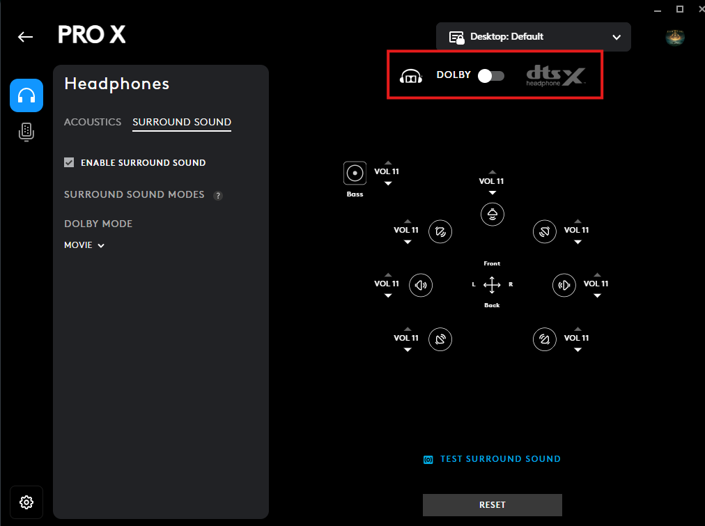

<p align="center">
  <h1 align="center">🎧 Logitech Headsets Modded Driver — Unlock Dolby in G HUB</h1>
</p>

<p align="center">
This modification is designed to unlock Dolby functionality in G HUB for supported Logitech headsets
</p>

<p align="center">
The driver itself is based on the original Logitech driver, with the necessary modifications applied to enable the Dolby functionality
</p>

---

## ✨ Features

- Dolby unlocked in G HUB along with DTS
- Based on the original Logitech headset driver
- Updated Blue VO!CE version for devices that already support it (Logitech Blue VO!CE 2.0 Effect)

<p align="center">
  <table>
    <tr>
      <td align="center" width="400">
        <br>
        <sub>🔊 Dolby</sub>
      </td>
      <td align="center" width="400">
        <br>
        <sub>🎙️ Blue VO!CE 2.0 Effect</sub>
      </td>
    </tr>
  </table>
</p>

---

## 🛠️ installation

**1. 📜 Install the certificate.**

**2. 💿 Install the modified driver through Device Manager.**

**3. 📁 Place the Dolby Unlock files in the following directory:**
```
C:\ProgramData\LGHUB\depots\824196\core\data\devices
```
> Note: The `824196` folder number may be different depending on your installed G HUB version. Use the corresponding folder for your current G HUB version.

**4. 🔄 Rename the following cache file to any name of your choice:**
```
C:\ProgramData\LGHUB\cache\cf28f08062c13c131b272626d16a34e0557cf9669a95cbe40d1a5da5238d5b4b
```
Example:
```
cf28f08062c13c131b272626d16a34e0557cf9669a95cbe40d1a5da5238d5b4b-999
```

**5. ⚙️ Stop all G HUB services through Task Manager, then delete the following file:**
```
%localappdata%\LGHUB\settings.db
```

---

## ✅ Tested / Compatibility

| Category | Details |
|---|---|
| **Headsets** | Logitech G430, G431, G432, G433, G533, G633, G635, G733, G933, G935, PRO X, PRO X WIRELESS |
| **OS** | Windows 10 / Windows 11 |
| **G HUB** | 2026.6.967771 / 2026.5.939708 / 2026.4.919028 |
